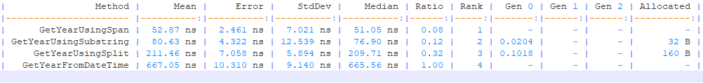

# Overview
Create new console application and install the BenchmarkDotNet NuGet package.


### Result



``` ini

BenchmarkDotNet=v0.12.0, OS=Windows 10.0.18362
Intel Core i3-3120M CPU 2.50GHz (Ivy Bridge), 1 CPU, 4 logical and 2 physical cores
.NET Core SDK=3.1.100
  [Host]     : .NET Core 3.1.0 (CoreCLR 4.700.19.56402, CoreFX 4.700.19.56404), X64 RyuJIT
  DefaultJob : .NET Core 3.1.0 (CoreCLR 4.700.19.56402, CoreFX 4.700.19.56404), X64 RyuJIT
